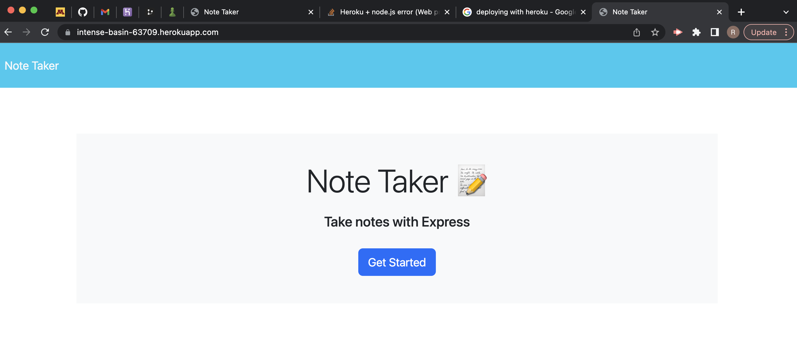
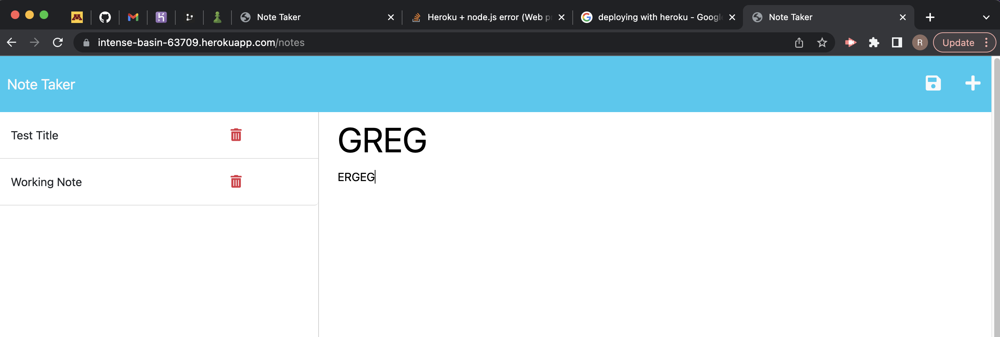

# ExpressJS-NoteTaker

### Author

Riley Altenburg

If you'd like to contact me, please email RileyAltenburg@gmail.com

### GitHub Information

Find my Repository information here at: https://github.com/RileyAlt/ExpressJS-NoteTaker

### Description

My Motivation for the project was to understand Node items further and introducing expanding myan HTML web page from your terminal and deploying a backend server

The project was built to create a responsive webpage that can create a list of Notes or tass you need completed, where the data remains on the page and you can remove the data

This solved how to generate a multiple HTML webpages with different API route is calls on
What I learn from the project was how to use Node properties to create different HTML webpage with a funcioning back-end server

### Installation

You must Run NPM Install or (NPM I) before starting your testing, to start the testing you must run the command "node server.js" you must have exress version downloaded as well(Alldependant on where you are to run the specific file.)

### Usage

The program runs as follows:

### Licensing

MIT

### Contributors

None

### Testing
